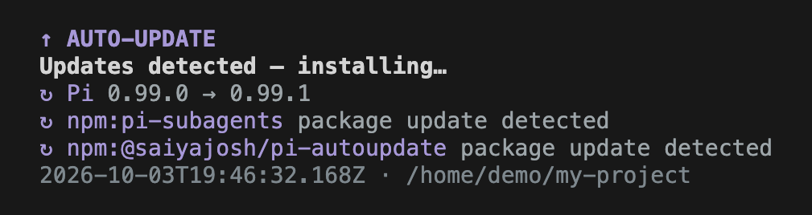
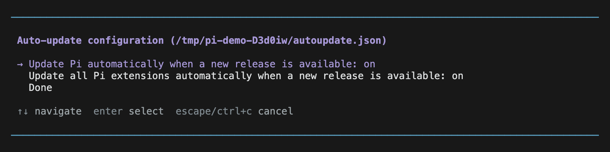
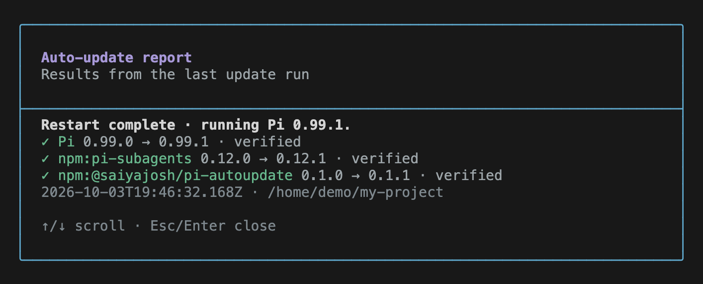

# pi-autoupdate

Automatically update Pi and its installed packages when you start Pi, then restart in the same saved session.

> Updates are **on by default** and run code from installed packages. Install only packages you trust. Tested with **Pi 0.99.1**.

## Get started

```sh
pi install npm:@saiyajosh/pi-autoupdate
```

Start Pi normally. If nothing needs updating, your session continues unchanged.



## Choose what updates

Run `/autoupdate-config`. Turn both options off to disable automatic updates. Changes apply the next time you start Pi.



“Extensions” includes all Pi-managed packages: extensions, skills, prompts, and themes. Local files and pinned versions stay unchanged.

Need to disable updates **before the first launch**, edit settings by hand, or use a different settings directory? See [advanced usage](docs/usage.md).

## Check the result

Run `/autoupdate-report` to see the last attempted update. This only shows results; it does not install anything.



*Screenshots show the real Pi UI with example data.*

If an update fails, Pi stays open and shows a warning. Check the report; restart manually if some updates were installed.

## Run from source

Requires Node **≥22.19.0** and pnpm **12.8.1**.

```sh
git clone https://github.com/saiyajosh/pi-autoupdate.git
cd pi-autoupdate
pnpm install --frozen-lockfile --ignore-scripts
pnpm run check
```

[Try it safely with updates disabled](CONTRIBUTING.md#try-the-extension), or follow the [contributor guide](CONTRIBUTING.md) to test changes and submit a PR.

Found a bug? [Open an issue](https://github.com/saiyajosh/pi-autoupdate/issues) with your Pi version, OS, and steps to reproduce. Remove credentials and private session data.
